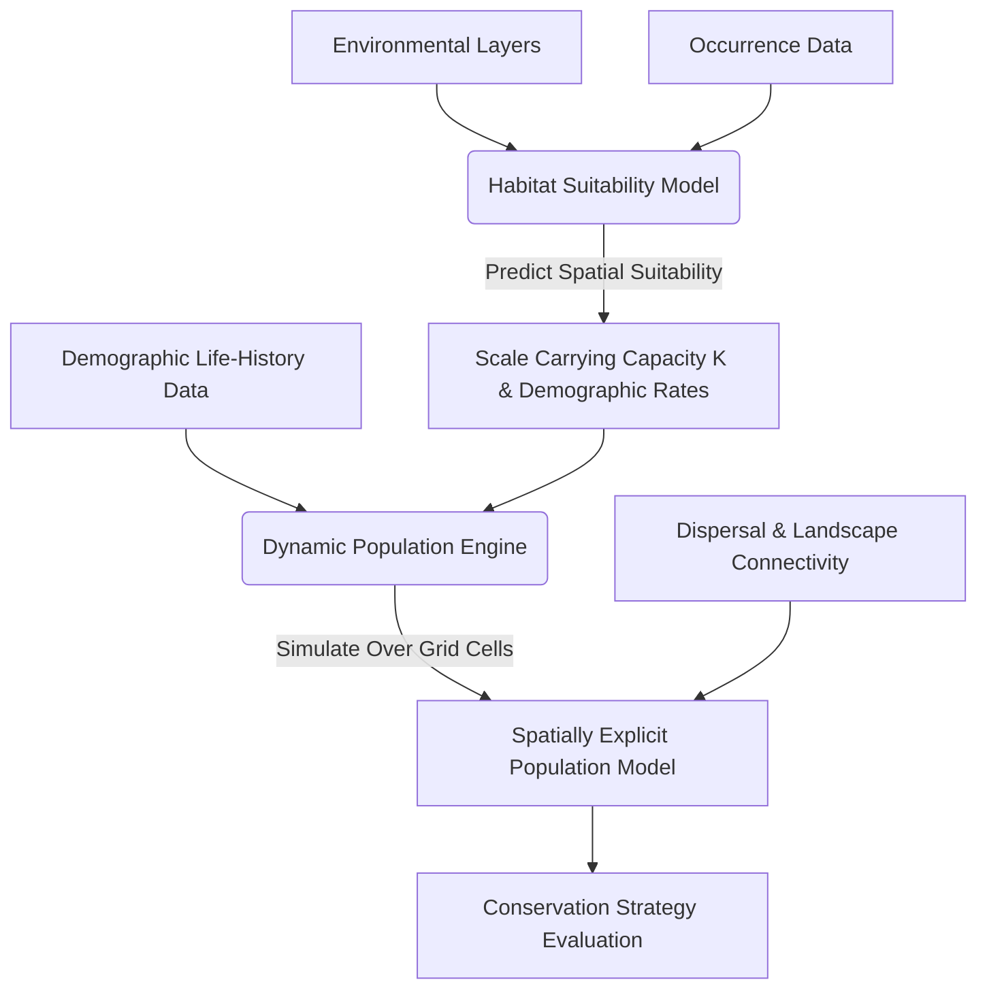

## In one sentence

A mathematical and statistical framework used to link ecological theory with empirical data, allowing researchers to estimate hidden state variables (such as abundance, occupancy, and survival) and forecast population dynamics under environmental uncertainty.

## Estimating Abundance: Mark-Recapture

In empirical ecology, counting every individual in a population is rarely feasible. Mark-recapture methods estimate the true, unobserved population size ($N$) by tracking a sample of marked individuals over multiple capture occasions.

### The Lincoln-Petersen Estimator

For a simple two-sample study design, the population size can be estimated using the classic **Lincoln-Petersen** estimator:

$$N = \frac{n_1 \cdot n_2}{m_2}$$

Where:

*   $N$ is the estimated total population size.
*   $n_1$ is the number of individuals captured, marked, and released in the first sampling event.
*   $n_2$ is the total number of individuals captured in the second sampling event.
*   $m_2$ is the number of marked individuals recaptured in the second sampling event.

### Chapman's Modification

The Lincoln-Petersen estimator is asymptotically unbiased but can exhibit extreme bias or become undefined when the recapture count ($m_2$) is small or zero. To correct for this small-sample bias, **Chapman's modification** is widely employed:

$$N_{\text{Chapman}} = \frac{(n_1 + 1)(n_2 + 1)}{m_2 + 1} - 1$$

This formulation adjusts the numerator and denominator to ensure a mathematically stable, unbiased estimate even in small populations.

### Estimating Variance and Standard Error

Under a Normal approximation, the large-sample variance of the Lincoln-Petersen estimator can be calculated using:

$$\text{Var}(N) = \frac{n_1^2 \cdot n_2 \cdot (n_2 - m_2)}{m_2^3}$$

The standard error ($\text{SE}$) is the square root of the variance:

$$\text{SE}(N) = \sqrt{\text{Var}(N)}$$

This allows for the construction of Wald-type $95\%$ confidence intervals ($\text{CI} = N \pm 1.96 \cdot \text{SE}(N)$) under asymptotic normality assumptions.

### R Implementation

Below is a clean, fully-commented R script to compute the Lincoln-Petersen and Chapman estimates alongside their variance and confidence intervals:

```r
# Lincoln-Petersen Abundance Estimation
n1 <- 100  # Marked in sample 1
n2 <- 120  # Captured in sample 2
m2 <- 30   # Recaptured marked individuals

# LP Estimate
N_est <- (n1 * n2) / m2

# Chapman Modification (unbiased for small samples)
N_chapman <- ((n1 + 1) * (n2 + 1)) / (m2 + 1) - 1

# Variance and 95% Confidence Interval (Normal approximation)
var_N <- (n1^2 * n2 * (n2 - m2)) / (m2^3)
se_N <- sqrt(var_N)
ci_lower <- N_est - 1.96 * se_N
ci_upper <- N_est + 1.96 * se_N

cat(sprintf("LP Estimate: %.1f\nChapman Estimate: %.1f\n95%% CI: [%.1f, %.1f]\n", 
            N_est, N_chapman, ci_lower, ci_upper))
```

### Core Assumptions

The validity of the Lincoln-Petersen estimator relies on three primary assumptions. Violations of these assumptions introduce predictable biases into the abundance estimate:

1.  **Population Closure:** The population is demographically and geographically closed during the study period (no births, deaths, immigration, or emigration occur between the first and second samples).
    *   *Violation:* If individuals emigrate or die between samples, the number of marked individuals available for recapture decreases. This artificially reduces $m_2$, resulting in a severe **overestimation** of $N$.
2.  **Equal Catchability (Homogeneity):** Every individual in the population has the same probability of being captured in both sampling periods, regardless of their marking status or individual traits.
    *   *Violation (Trap-Shyness):* If marked individuals become "trap-shy" due to the negative experience of initial capture, their probability of being recaptured decreases. This reduces $m_2$ below its expected value, resulting in a positive bias (**overestimating** $N$).
    *   *Violation (Trap-Happiness):* If marked individuals become "trap-happy" (e.g., attracted to food bait in traps), they are recaptured at a higher rate. This artificially increases $m_2$, leading to a negative bias (**underestimating** $N$).
3.  **Mark Retention and Recognition:** Marked individuals do not lose their marks between sampling events, and observers detect and record all marks without error.
    *   *Violation:* If marks are lost or overlooked, recaptured marked individuals are recorded as unmarked. This artificially decreases $m_2$, resulting in a severe **overestimation** of $N$.

### Open Populations: Jolly-Seber and Cormack-Jolly-Seber

When the demographic closure assumption is violated over longer study intervals, ecologists transition to open-population models:

*   **Jolly-Seber (JS) Models:** Formulated for situations where the population is subject to birth, death, immigration, and emigration. JS models track changes in abundance ($N_t$), survival probability ($\phi_t$), and entry rates ($B_t$) across multiple sampling periods.
*   **Cormack-Jolly-Seber (CJS) Models:** Condition strictly on the first capture of an individual to estimate apparent survival ($\phi_t$) and detection probability ($p_t$). Unlike JS models, standard CJS models do not attempt to estimate total abundance ($N_t$), focusing instead on pure demographic rates.

---

## Estimating Presence: Occupancy Modelling

Ecologists are often interested in the distribution of a species across a landscape. However, surveying a site and failing to find the species does not guarantee its absence. There is a fundamental challenge of **imperfect detection** ($p < 1$), where a species is present but remains undetected during a survey (a *false negative*).

Occupancy modelling solves this by conducting replicate visits to a set of sites to estimate both the probability of occupancy ($\psi$) and the probability of detection ($p$).

### Hierarchical Model Formulation

Occupancy models are structured hierarchically to separate the underlying ecological state process from the physical observation process:

1.  **Latent State Process:** The true, unobserved occupancy state ($z_i$) at site $i$ is modelled as a Bernoulli trial:
    $$z_i \sim \text{Bernoulli}(\psi_i)$$
    Where:
    *   $z_i = 1$ if site $i$ is occupied, and $z_i = 0$ if site $i$ is unoccupied.
    *   $\psi_i$ is the probability that site $i$ is occupied.

2.  **Observation Process:** The observed detection or nondetection ($y_{ij}$) during survey $j$ at site $i$ is conditional upon the true latent state ($z_i$):
    $$y_{ij} \mid z_i \sim \text{Bernoulli}(z_i \cdot p_{ij})$$
    Where:
    *   $y_{ij} = 1$ if the species is detected, and $y_{ij} = 0$ if undetected.
    *   $p_{ij}$ is the detection probability at site $i$ during survey $j$, given that the site is occupied.
    *   If the site is unoccupied ($z_i = 0$), detection is impossible: $y_{ij} = 0$ with probability $1$.

### Incorporating Covariates

To model how environmental or weather features influence occupancy and detection, we use logit-link functions (analogous to logistic regression):

*   **Site-level covariates (e.g., habitat type, elevation) affecting occupancy:**
    $$\text{logit}(\psi_i) = \ln\left(\frac{\psi_i}{1 - \psi_i}\right) = \beta_0 + \beta_1 \cdot X_i$$
    Where $X_i$ is a covariate representing conditions at site $i$.

*   **Survey-level covariates (e.g., wind speed, temperature, Julian date) affecting detection:**
    $$\text{logit}(p_{ij}) = \ln\left(\frac{p_{ij}}{1 - p_{ij}}\right) = \alpha_0 + \alpha_1 \cdot W_{ij}$$
    Where $W_{ij}$ is a covariate representing conditions at site $i$ during survey $j$.

---

## Separating Process and Observation: State-Space Models

Ecological time series are noisy. Fluctuations in observed population data are driven by two entirely different sources of variation:

1.  **Process Noise ($\sigma^2_{\text{proc}}$):** Real biological variation resulting from demographic stochasticity, environmental fluctuations, or density-dependent interactions.
2.  **Observation Error ($\sigma^2_{\text{obs}}$):** Human or technical measurement error, varying weather conditions during sampling, and sampling limitations.

**State-space models (SSMs)** mathematically isolate these two variance components by tracking an unobserved true state through time alongside a separate observation equation.

### Linear State-Space Model Formulation

A linear, Gaussian state-space model is formulated as:

1.  **Process/State Equation:**
    $$x_t = f(x_{t-1}) + \epsilon_t, \quad \epsilon_t \sim \mathcal{N}(0, \sigma^2_{\text{proc}})$$
    Where $x_t$ is the true, unobserved population state (e.g., log-abundance) at time $t$, $f(x_{t-1})$ is the biological transition function (such as a Gompertz or Ricker growth model), and $\epsilon_t$ represents process noise.

2.  **Observation/Measurement Equation:**
    $$y_t = g(x_t) + \eta_t, \quad \eta_t \sim \mathcal{N}(0, \sigma^2_{\text{obs}})$$
    Where $y_t$ is the observed index of population size, $g(x_t)$ maps the latent state to the observation scale, and $\eta_t$ represents measurement/observation error.

### Why This Matters for Extinction Risk

In conservation biology, Population Viability Analysis (PVA) is used to predict the probability that a population will fall below a critical threshold (extinction risk).

If an analyst ignores observation error and attributes all historical variance to biological process noise (i.e., assuming $\sigma^2_{\text{obs}} = 0$):

$$\sigma^2_{\text{estimated process}} \approx \sigma^2_{\text{proc}} + \sigma^2_{\text{obs}}$$

The model will **overestimate the true process noise** of the population dynamics. Because extinction risk is highly sensitive to the variance of the growth rate—where larger fluctuations dramatically increase the probability of a population hitting zero—this mistake will artificially inflate simulated population volatility, leading to **overly pessimistic and incorrect predictions of extinction risk**.

---

## Predicting Geographic Space: Habitat Suitability Modelling

**Habitat Suitability Models (HSMs)**, also known as **Species Distribution Models (SDMs)**, establish statistical relationships between species occurrence data and spatial environmental layers.

*   **Objective:** Predict the probability of occurrence or relative suitability of habitat across geographic space.
*   **Data Inputs:** Georeferenced presence/absence or presence-only data combined with GIS raster layers (e.g., annual temperature, soil pH, canopy cover, elevation).
*   **Model Engines:** 
    *   *Generalized Linear Models (GLMs)* and *Generalized Additive Models (GAMs)* for parametric and semi-parametric regression.
    *   *MaxEnt (Maximum Entropy)* for presence-only or presence-background data.
    *   *Random Forests* and other machine learning algorithms for complex non-linear interactions.
*   **Key Limitation:** HSMs are primarily **spatial and static**. They assume species-environment relationships are in equilibrium and do not explicitly model population dynamics, dispersal limitations, or biotic interactions over time.

---

## Projecting Future Viability: Population Viability Analysis

**Population Viability Analysis (PVA)** is a dynamic, risk-assessment modelling approach used to project population size over time.

*   **Objective:** Predict the probability of extinction, quasi-extinction, or population recovery over a defined time horizon (e.g., the next 100 years).
*   **Key Components:**
    *   *Matrix Projection Models (Leslie or Lefkovitch matrices):* Track populations structured by age or stage classes, incorporating vital rates such as survival and fecundity.
    *   *Demographic Stochasticity:* Chance variation in individual survival and reproduction. This has an enormous impact on small populations, where a run of "bad luck" can lead to rapid extinction.
    *   *Environmental Stochasticity:* Temporal fluctuations in demographic rates driven by climate, disease, or resource shifts, which affect all individuals in the population simultaneously.
*   **Key Limitation:** Classic PVAs are primarily **temporal and dynamic but non-spatial**. They often treat the population as a single homogeneous pool, ignoring spatial heterogeneity, local environmental variations, and geographic barriers to dispersal.

---

## Integrating Space and Time: Spatially Explicit Population Models

To overcome the limitations of purely static spatial models (HSMs) and purely non-spatial dynamic models (PVAs), ecologists combine them into **Spatially Explicit Population Models (SEPMs)**.



### The SEPM Pipeline

1.  **Spatial Suitability Mapping:** A static HSM is trained using environmental covariates and species occurrence data to generate a continuous grid of habitat suitability.
2.  **Demographic Scaling:** The suitability values of this grid are used to scale demographic parameters within each grid cell. Most commonly, the carrying capacity ($K_i$) of grid cell $i$ is calculated as a function of its habitat suitability:
    $$K_i = K_{\text{max}} \cdot f(\text{Suitability}_i)$$
    Fecundity or survival rates can similarly be linked to suitability.
3.  **Local Population Dynamics:** A temporal PVA is simulated inside each grid cell, tracking stage-structured demographics, environmental stochasticity, and density-dependence.
4.  **Dispersal and Connectivity:** Grid cells are connected via explicit dispersal functions (e.g., kernels or path-finding algorithms), simulating how individuals migrate across the landscape, recolonise empty patches, and rescue struggling local populations.

### Conservation Applications

SEPMs allow conservation scientists to evaluate complex, spatially-structured management scenarios:

*   **Wildlife Corridor Design:** Simulating how establishing stepping-stone habitats or continuous corridors alters metapopulation survival under fragmentation.
*   **Reserve Design:** Testing whether a single large reserve or several small reserves (the SLOSS debate) provides higher persistence for a target species.
*   **Climate Adaptation:** Projecting species range shifts under climate change, determining if natural dispersal speeds can keep pace with moving climate envelopes.

---

## Remember

::: {.callout-tip}
To accurately forecast ecological dynamics, models must separate biological process noise from observation error, and couple static spatial suitability with dynamic demographic processes.
:::

---

## Check your understanding

### 1. Mark-recapture bias

Under trap-shyness, marked individuals are less likely to be caught in the second sampling event. Explain mathematically how this biases the population estimate.

<details>
<summary>Click to view the mathematical explanation</summary>

The Lincoln-Petersen estimator is defined as:

$$N = \frac{n_1 \cdot n_2}{m_2}$$

Where $m_2$ is the number of marked individuals recaptured in the second sample. Under trap-shyness, marked individuals actively avoid traps, reducing their individual capture probability below that of unmarked individuals. 

Consequently, the observed number of recaptures ($m_2$) will be lower than expected under equal catchability. Because $m_2$ is in the denominator of the estimator, a smaller value of $m_2$ mathematically inflates the fraction:

$$\text{As } m_2 \downarrow, \quad \frac{n_1 \cdot n_2}{m_2} \uparrow$$

This results in a systematic **positive bias** (overestimating the true population size $N$).

</details>

### 2. Nondetection probability

A species occupies a forest site ($z_i = 1$). The probability of detecting the species during a single standardized survey visit is $p = 0.4$. If an ecologist visits this site 4 times independently, what is the probability of failing to detect the species across all 4 visits?

<details>
<summary>Click to view the step-by-step solution</summary>

Let the probability of detection on a single visit be $p = 0.4$. 

The probability of failing to detect the species on a single visit (a false negative) is:

$$P(\text{Undetected} \mid \text{Present}) = 1 - p = 1 - 0.4 = 0.6$$

Assuming that the visits are independent, the probability of failing to detect the species across all $J = 4$ visits is the product of the individual nondetection probabilities:

$$P(\text{Undetected across 4 visits} \mid \text{Present}) = (1 - p)^J = (0.6)^4$$

Calculating the value:

$$(0.6)^4 = 0.1296$$

**Answer:** There is a **$12.96\%$** (or roughly $13\%$) chance of failing to detect the species across all 4 visits, which would lead to a false-absence record for that site.

</details>

### 3. State-space variance and extinction risk

Explain why ignoring observation noise in a population time series leads to overestimating extinction risk in forward-projecting Population Viability Analyses (PVAs).

<details>
<summary>Click to view the biological and mathematical explanation</summary>

An observed population time series contains both biological fluctuations (process noise, $\sigma^2_{\text{proc}}$) and sampling noise (observation error, $\sigma^2_{\text{obs}}$). 

If we fit a simple non-state-space model and ignore observation noise ($\sigma^2_{\text{obs}} = 0$), the statistical estimator must attribute all of the historic series' variance to process noise. This inflates the estimated process variance:

$$\sigma^2_{\text{estimated process}} \approx \sigma^2_{\text{true process}} + \sigma^2_{\text{observation}}$$

When we use this inflated variance to project the population forward in a PVA, we simulate future trajectories with exaggerated environmental volatility. Because a population's extinction probability is highly sensitive to the variance of its growth rate (with higher variance making extreme downward plunges far more likely, even if the average growth rate is positive), this inflated process noise artificially increases the number of simulated trajectories that cross the extinction threshold. 

This leads to **overly pessimistic, inflated predictions of extinction risk**, which can misallocate conservation resources.

</details>

---

## Further reading

*   **Royle, J. A., & Dorazio, R. M. (2008).** *Hierarchical Modeling and Inference in Ecology: The Analysis of Data from Populations, Metapopulations and Communities*. Academic Press. *(The definitive text on hierarchical models, detailing state-space and occupancy model formulations)*.
*   **MacKenzie, D. I., Nichols, J. D., Royle, J. A., Pollock, K. H., Bailey, L. L., & Hines, J. E. (2017).** *Occupancy Estimation and Modeling: Inferring Patterns and Dynamics of Species Occurrence*. Academic Press. *(Comprehensive resource for occupancy modelling concepts and applications)*.
*   **Akçakaya, H. R. (2000).** *Spatially explicit population models for conservation planning*. Solid State Phenomena, 71, 73-90. *(Excellent overview of the development, structure, and applications of SEPMs in reserve design and risk assessment)*.
*   **Williams, B. K., Nichols, J. D., & Conroy, M. J. (2002).** *Analysis and Management of Animal Populations*. Academic Press. *(A cornerstone reference for mark-recapture and decision-making under ecological uncertainty)*.
