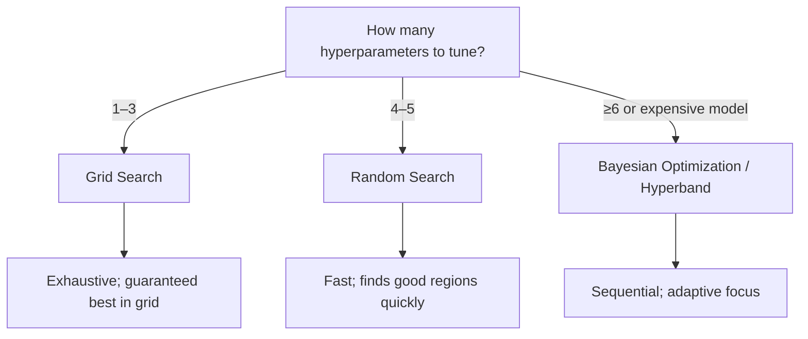
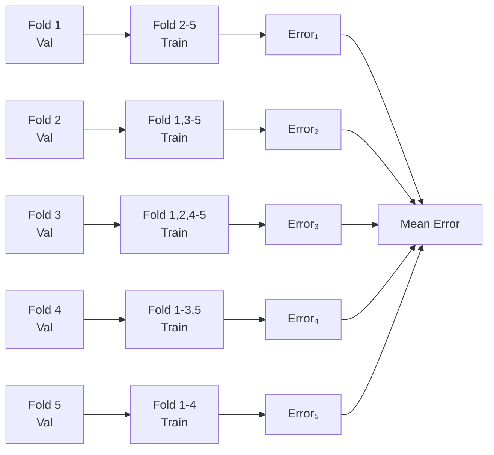
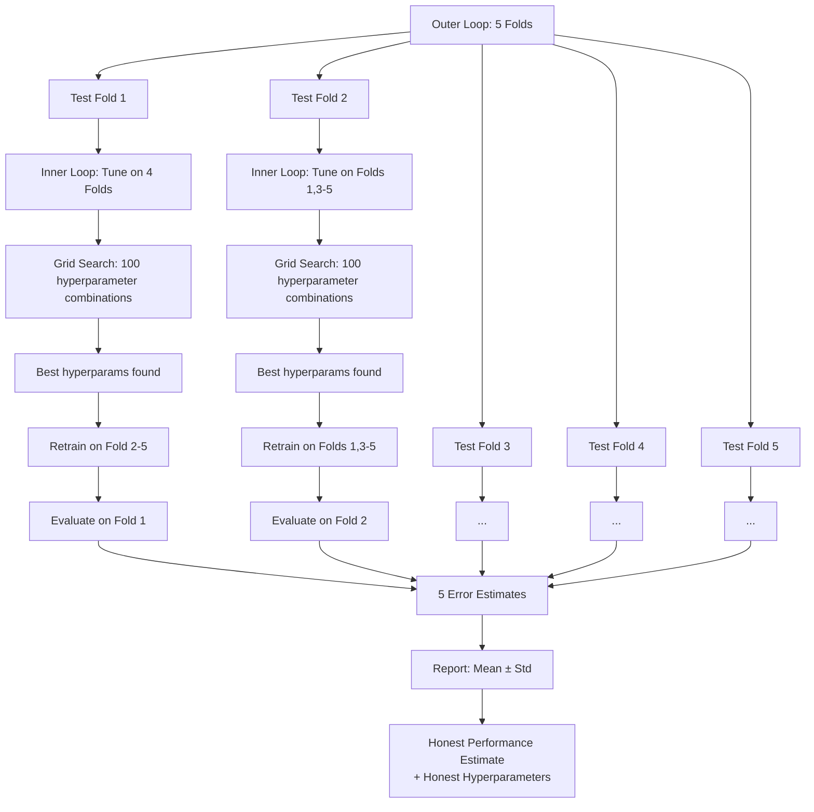
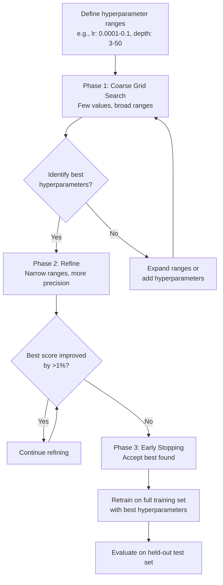
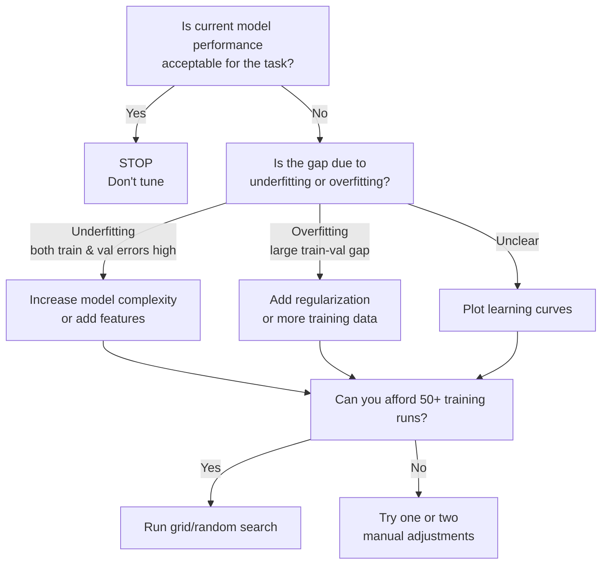

## In one sentence

Hyperparameter tuning systematically adjusts model configuration (learning rate, tree depth, regularization) before training to minimize validation error and prevent overfitting—but only when marginal improvement justifies the computational cost.

## Why hyperparameter tuning matters

A poorly chosen learning rate can make training 10× slower. A regularization strength set too high kills model performance; too low causes overfitting. A tree depth that's too deep wastes compute and generalizes poorly. At scale—1000 hyperparameter combinations on 10 million rows—tuning costs explode. Grid search alone can consume thousands of GPU hours.

But *not* tuning is equally dangerous: default hyperparameters are often mediocre compromises, leaving 5–20% performance on the table. The real cost is in *wasted exploration*: random guessing, tuning on the test set (data leakage), and stopping too early or too late.

The goal: **systematic tuning beats random guessing, but stop when improvements plateau.**

---

## Core idea: Hyperparameters vs. Parameters

**Parameters** are learned from data:
- Neural network weights and biases
- Coefficients in linear regression
- Tree split thresholds
- These emerge during training via backpropagation, gradient descent, or splitting criteria.

**Hyperparameters** are fixed *before* training:
- Learning rate (gradient descent step size)
- Batch size (samples per update)
- Tree depth or number of trees
- Regularization strength (L1, L2 penalty)
- Dropout rate, kernel size (neural networks)
- Number of neighbors (k-NN)

The distinction matters: you *tune* hyperparameters via external loops (grid search, random search); you *learn* parameters via training. Tuning is expensive; training a single model on a fixed hyperparameter set is routine.

**Why tuning matters:** Hyperparameters control the bias-variance trade-off. A high learning rate trains fast but may miss the optimum. A low learning rate crawls toward a good solution. Too much regularization underfits; too little overfits. Orders of magnitude differences in performance come from hyperparameters, not minor algorithmic tweaks.

---

## Understanding learning curves: Detecting overfitting and underfitting

A **learning curve** plots training and validation error against time (epochs) or dataset size. It reveals whether your model is overfitting, underfitting, or just right.

**What to look for:**

- **Overfitting**: Training error decreases steadily; validation error decreases initially, then increases. The model memorizes training data but fails on unseen data.
- **Underfitting**: Both training and validation error plateau at high values. The model lacks capacity to learn the underlying pattern.
- **Just right**: Training error continues to decrease; validation error also decreases and stays close to training error. Generalization is working.

**Example learning curve:**

```mermaid
xychart-beta
    title "Overfitting vs. Underfitting vs. Just Right"
    x-axis [0, 5, 10, 15, 20, 25, 30] "Epochs"
    y-axis "Error" 0 --> 1
    line [0.9, 0.7, 0.5, 0.4, 0.35, 0.33, 0.32] "Train (Overfitting)"
    line [0.9, 0.7, 0.5, 0.4, 0.42, 0.50, 0.58] "Val (Overfitting)"
    line [0.9, 0.85, 0.82, 0.81, 0.80, 0.80, 0.80] "Train (Underfitting)"
    line [0.9, 0.85, 0.82, 0.81, 0.80, 0.80, 0.80] "Val (Underfitting)"
    line [0.9, 0.7, 0.5, 0.4, 0.35, 0.33, 0.32] "Train (Just Right)"
    line [0.9, 0.72, 0.52, 0.42, 0.36, 0.34, 0.33] "Val (Just Right)"
```

**How to generate a learning curve in Python:**

```python
import numpy as np
import matplotlib.pyplot as plt
from sklearn.neural_network import MLPClassifier
from sklearn.datasets import make_classification
from sklearn.model_selection import train_test_split

# Generate synthetic data
X, y = make_classification(n_samples=1000, n_features=20, random_state=42)
X_train, X_val, y_train, y_val = train_test_split(X, y, test_size=0.2, random_state=42)

# Warm-start training: train one epoch at a time and record errors
model = MLPClassifier(hidden_layer_sizes=(100, 50), max_iter=1, warm_start=True, random_state=42)
train_errors = []
val_errors = []

for epoch in range(50):
    model.fit(X_train, y_train)
    train_loss = 1 - model.score(X_train, y_train)  # 1 - accuracy = error
    val_loss = 1 - model.score(X_val, y_val)
    train_errors.append(train_loss)
    val_errors.append(val_loss)

# Plot
plt.figure(figsize=(10, 6))
plt.plot(range(50), train_errors, label='Training Error', marker='o')
plt.plot(range(50), val_errors, label='Validation Error', marker='s')
plt.xlabel('Epochs')
plt.ylabel('Error (1 - Accuracy)')
plt.title('Learning Curve: Detecting Overfitting')
plt.legend()
plt.grid(True, alpha=0.3)
plt.show()

# Interpretation: if val_errors spike while train_errors keep falling → overfitting
# Action: stop earlier (early stopping), reduce model complexity, or add regularization
```

**Diagnosing with learning curves:**

- **Overfitting gap widens?** Add regularization (L2 penalty, dropout), reduce model size, increase training data.
- **Both errors plateau high?** Model lacks capacity; increase complexity (more layers, tree depth, feature engineering).
- **Curves are close and decreasing?** Keep training; you're learning well.

::: {.callout-important}
Plot learning curves *before* tuning other hyperparameters. They reveal whether the bottleneck is underfitting (model too simple) or overfitting (model too complex). Tuning learning rate won't fix underfitting.
:::

---

## Grid search vs. random search: When to use each

**Grid Search**: Test all combinations of hyperparameter values.
- Example: learning_rate in [0.001, 0.01, 0.1] and batch_size in [16, 32, 64] = 9 models.
- Exhaustive within the specified ranges; guarantees finding the best combination.
- Computationally expensive: $n$ hyperparameters with $k$ values each = $k^n$ models to train.
- Works well for ≤3 hyperparameters.

**Random Search**: Randomly sample from hyperparameter distributions.
- Example: learning_rate from log-uniform [0.0001, 0.1] and batch_size from uniform [16, 128], 100 random draws.
- Faster than grid search; finds good regions without exhaustively covering space.
- Effective for high-dimensional problems; studies show random search beats grid search for ≥5 hyperparameters.
- No guarantee of finding the *exact* optimum, but often good enough faster.

**Decision flowchart:**



**Visual comparison: Coverage patterns**

```python
import numpy as np
import matplotlib.pyplot as plt

# Simulate 2D hyperparameter space: learning_rate × batch_size
np.random.seed(42)

# Grid search: 5×5 regular grid
grid_lr = np.repeat(np.linspace(0.0001, 0.1, 5), 5)
grid_bs = np.tile(np.linspace(16, 128, 5), 5)

# Random search: 25 random points
random_lr = np.random.uniform(0.0001, 0.1, 25)
random_bs = np.random.uniform(16, 128, 25)

fig, (ax1, ax2) = plt.subplots(1, 2, figsize=(12, 5))

ax1.scatter(grid_lr, grid_bs, s=100, alpha=0.6, color='blue', marker='s')
ax1.set_title('Grid Search: Regular Coverage')
ax1.set_xlabel('Learning Rate (log scale)')
ax1.set_ylabel('Batch Size')
ax1.set_xscale('log')

ax2.scatter(random_lr, random_bs, s=100, alpha=0.6, color='red', marker='o')
ax2.set_title('Random Search: Scattered Coverage')
ax2.set_xlabel('Learning Rate (log scale)')
ax2.set_ylabel('Batch Size')
ax2.set_xscale('log')

plt.tight_layout()
plt.show()

# Takeaway: Grid covers the space systematically; Random covers it sparsely but can find
# good regions that Grid might miss if the grid is too coarse.
```

**When to switch strategies:**
- Start with grid search if tuning 1–2 critical hyperparameters.
- Switch to random search when tuning 4+ hyperparameters or when compute is limited.
- Use Bayesian optimization (e.g., Optuna, scikit-optimize) when the model is expensive (e.g., neural network on large data) and you can afford 50–200 training runs.

---

## Cross-validation & preventing overfitting to the validation set

**The problem:** If you tune hyperparameters on a single validation set, you're implicitly using that set as training information. Repeated checking ("this hyperparameter combination validates well") fits the *validation set*, not just the model. You get optimistic estimates of performance.

**The solution: k-fold cross-validation for hyperparameter tuning**

Divide training data into k folds (typically 5). For each hyperparameter combination:
1. Use folds 1–4 to train the model.
2. Evaluate on fold 5.
3. Rotate: use folds 2–5 to train, evaluate on fold 1.
4. Repeat until all folds have been validation sets.
5. Report average validation error across all folds.

This ensures every training example participates in both training and validation, spreading the risk.

**Visual: 5-fold cross-validation**



**Nested cross-validation: Separate tuning from evaluation**

For unbiased hyperparameter selection *and* honest performance estimation:



**Code outline (scikit-learn pattern):**

```python
from sklearn.model_selection import GridSearchCV, cross_validate
from sklearn.tree import DecisionTreeClassifier
from sklearn.datasets import make_classification

X, y = make_classification(n_samples=1000, n_features=20, random_state=42)

# Inner loop: tune hyperparameters
param_grid = {
    'max_depth': [3, 5, 7, 10],
    'min_samples_split': [2, 5, 10]
}

grid_search = GridSearchCV(
    DecisionTreeClassifier(random_state=42),
    param_grid,
    cv=5,  # Inner 5-fold CV
    scoring='accuracy'
)

# Outer loop: evaluate on held-out folds
outer_cv_scores = cross_validate(
    grid_search,
    X, y,
    cv=5,  # Outer 5-fold CV
    scoring='accuracy'
)

print(f"Honest performance: {outer_cv_scores['test_score'].mean():.3f} ± {outer_cv_scores['test_score'].std():.3f}")
```

::: {.callout-important}
Common mistake: Tuning on a single validation set, then reporting "validation accuracy" as model performance. This is overly optimistic. Use nested CV for an unbiased estimate.
:::

---

## Practical tuning workflow: Coarse-to-fine with early stopping

A systematic approach to tuning saves compute and finds good hyperparameters efficiently.

**Phase 1: Coarse Tuning**
- Use broad ranges and few values.
- Example: learning_rate in [0.0001, 0.001, 0.01, 0.1, 1.0]; max_depth in [3, 5, 10, 20, 50].
- Purpose: identify promising regions of hyperparameter space.
- Computational cost: moderate (e.g., 25 models trained).

**Phase 2: Refine**
- Narrow ranges around the best performers from Phase 1.
- Example: Learning rate was best at 0.01 in Phase 1 → now try [0.005, 0.01, 0.015, 0.02, 0.025].
- Purpose: precision tuning within promising regions.
- Cost: similar to Phase 1, but results are more stable.

**Phase 3: Early Stopping & Diminishing Returns**
- Monitor marginal improvement.
- If the last 10 tuning iterations improve validation accuracy by < 0.1%, stop.
- Real-world example: Model accuracy goes 0.85 → 0.853 → 0.854 → 0.8541 → 0.8542. Stop here; tuning further wastes GPU hours.

**Workflow diagram:**



**Real example: Learning rate tuning**

- Phase 1: Try [0.0001, 0.001, 0.01, 0.1, 1.0] on a small sample (1000 rows). Best: 0.01 (val_loss = 0.48).
- Phase 2: Try [0.005, 0.01, 0.015, 0.02, 0.025] on full training data. Best: 0.015 (val_loss = 0.46).
- Phase 3: Marginal gain = 0.48 - 0.46 = 0.02 = 4%. Worth exploring further? Try [0.012, 0.015, 0.018]. Best: 0.015 still. No improvement. Stop.

::: {.callout-tip}
Start coarse tuning on a *sample* of data (1000–10,000 rows) to iterate quickly. Once you've narrowed the search space, retrain on the full dataset for Phase 2 and 3.
:::

---

## When NOT to optimize: Diminishing returns and decision tree

Not every model needs hyperparameter tuning. Tuning costs compute and human time.

**Decision tree: Should you tune?**



**When to skip tuning:**

1. **Simple datasets**: On a small classification task (< 1000 rows, < 10 features), default hyperparameters often achieve 95%+ of peak performance. Tuning saves 1–2% accuracy but costs hours.

2. **Diminishing returns plateau**: If you've tuned 5 times and each round improves performance by < 0.5%, stop. The effort-to-gain ratio becomes negative.

3. **Model choice, not tuning**: Sometimes a different algorithm (random forest instead of a single decision tree) beats tuning the original model. Prioritize choosing the right model before tuning the wrong one.

4. **Production readability matters**: A well-tuned neural network is a black box; a logistic regression with default parameters is interpretable. Trade performance for clarity if interpretability is required.

**Real-world trade-off:**

| Scenario | Current Performance | Tuning Effort | Potential Gain | Recommendation |
|----------|-------------------|---------------|----------------|-----------------|
| Baseline model on 10M rows | 0.82 accuracy | 100 GPU hours | +0.03 | Tune (3% gain on critical system) |
| Internal prototype | 0.85 accuracy | 50 GPU hours | +0.01 | Skip (1% not worth 50 GPU hours) |
| Production model, model choice not yet made | 0.80 accuracy | 20 GPU hours | +0.05 | Try different model first (tree vs. NN) |
| Rare-disease classifier, false negatives catastrophic | 0.91 recall | 200 GPU hours | +0.02 recall | Tune (every percentage point matters) |

::: {.callout-important}
Tuning is an investment: compute costs (GPU hours, $$) + human time. Only invest if the expected return (performance gain × business impact) exceeds the cost.
:::

---

## Common mistakes when tuning

- **Tuning on the test set**: Repeatedly evaluating on test data turns it into training information. Always use cross-validation or a separate validation set that stays untouched until the final report.
- **Grid too coarse or too broad**: If the grid [0.0001, 0.1] for learning rate misses the sweet spot at 0.003, you'll waste iterations. Use logarithmic spacing for rates and exponential ranges.
- **Forgetting to scale features**: Some algorithms (neural networks, SVMs, k-NN) are sensitive to feature scale. Standardize features (mean 0, std 1) before tuning learning rates or distances.
- **Tuning one hyperparameter in isolation**: Hyperparameters interact. A high learning rate might work fine with a small batch size but fail with a large one. Use grid or random search, not one-at-a-time loops.
- **Stopping too early**: Early stopping (halting training when validation error stops improving) prevents overfitting *within* a single training run. Tuning (adjusting hyperparameters across runs) is separate. Use both.

---

## Remember

::: {.callout-tip}
Systematic tuning beats random guessing; coarse-to-fine beats exhaustive grid search; stop when improvement plateaus—not when you've run out of ideas.
:::

---

## Test yourself

1. You train a neural network and notice training loss continues to decrease, but validation loss plateaus and then increases. What's happening, and what should you adjust first: learning rate, batch size, or regularization?

2. You have 8 hyperparameters to tune: learning rate, batch size, dropout, L2 weight decay, number of layers, hidden layer size, activation function, and optimizer. Grid search over 3 values each would require $3^8 = 6561$ training runs—infeasible. Would you use grid search or random search? Why?

---

## Related topics

- [Model Evaluation and Validation](model-evaluation-validation.qmd): Choosing metrics and avoiding data leakage.
- [Supervised Learning](supervised-learning.qmd): Regression vs. classification, model selection basics.
- [Python CLI Workflows](../programming-computing/python-cli-workflows.qmd): Running hyperparameter tuning jobs in batch/parallel.
- [Python Virtual Environments](../programming-computing/python-virtual-environments.qmd): Managing dependencies for reproducible tuning experiments.
