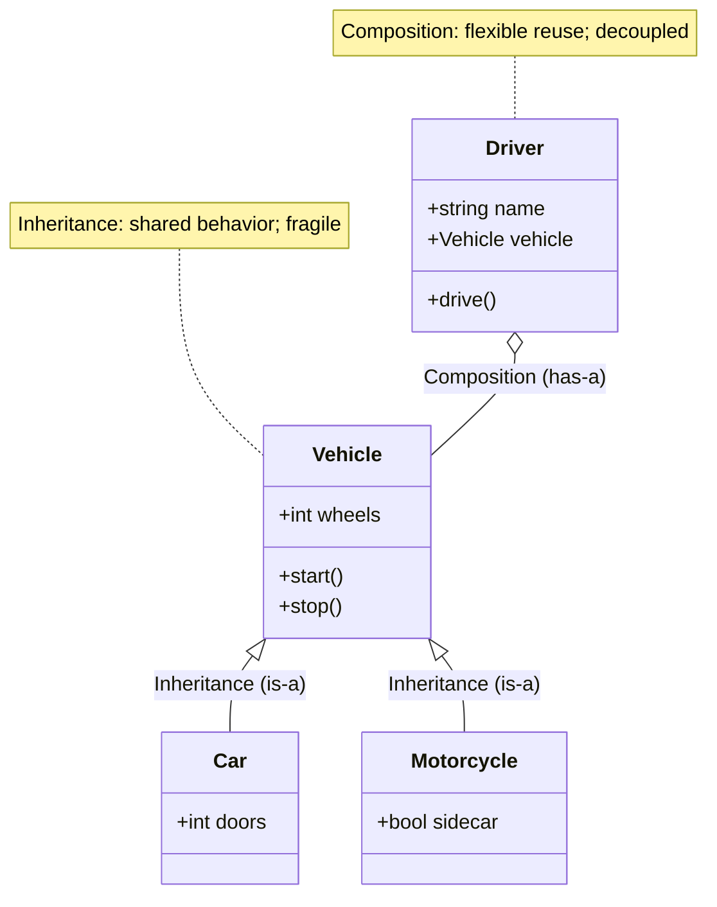
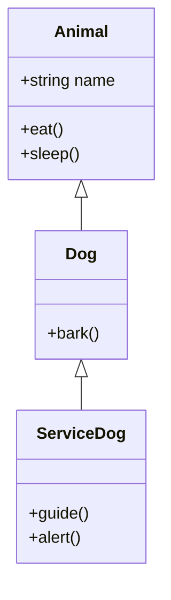
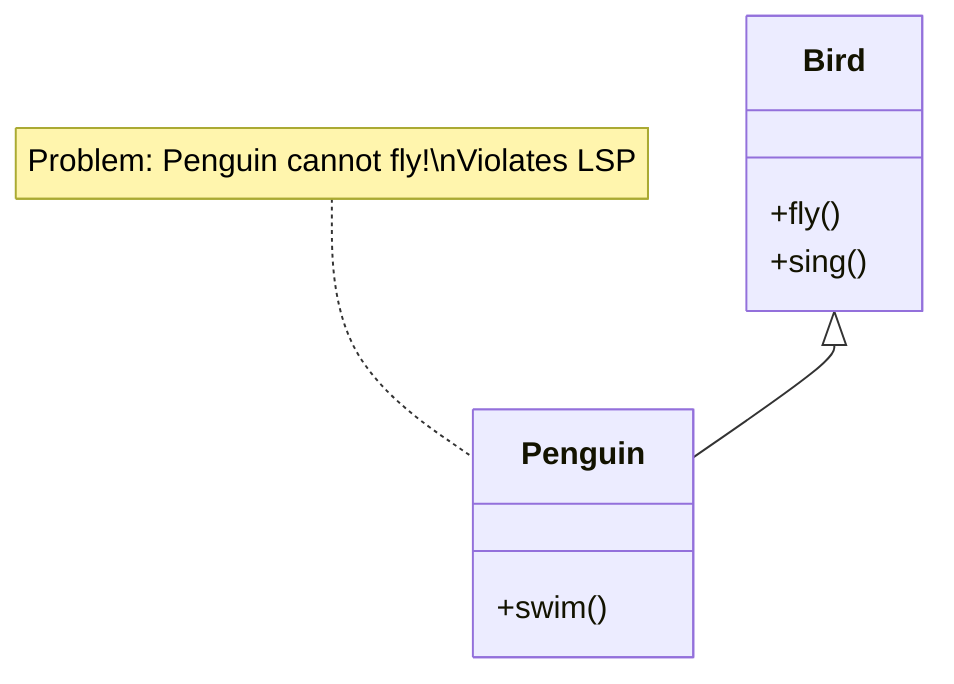
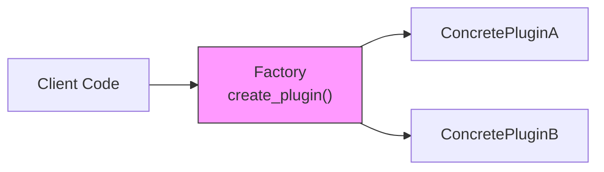
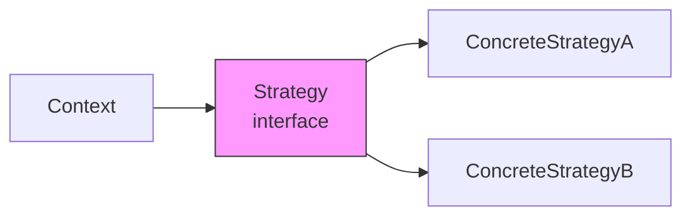
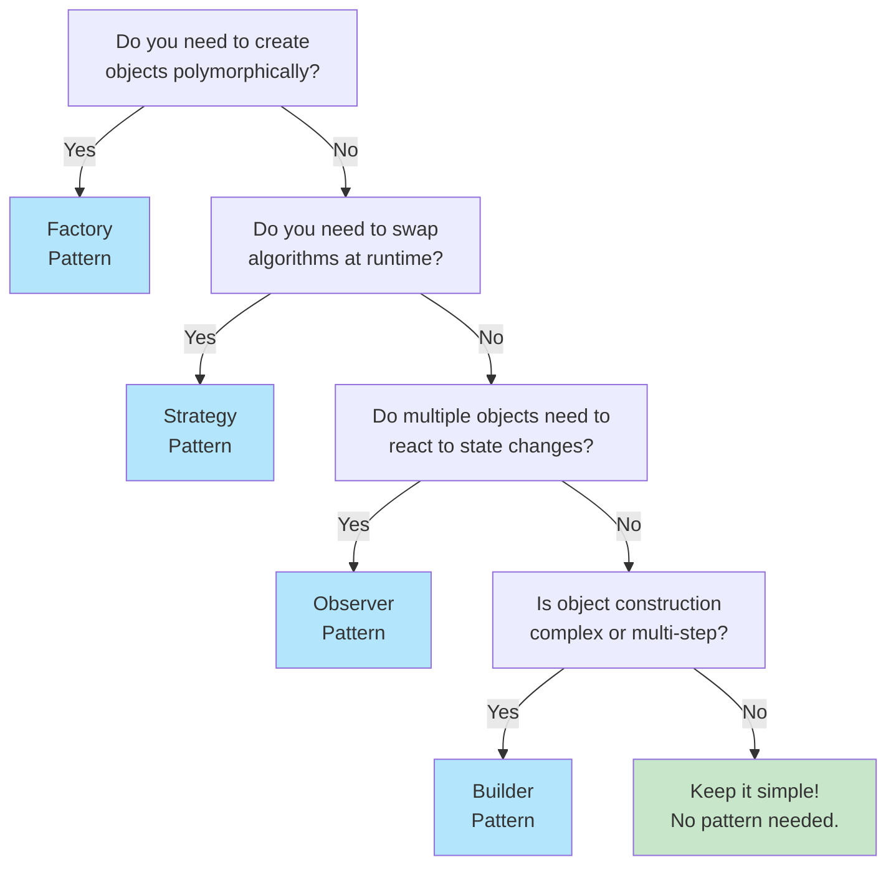

## In one sentence

Design patterns are reusable solutions to common structural problems; use them to reduce coupling, improve testability, and make code maintainable as complexity grows.

## Why does it matter?

Large codebases fail not from algorithmic complexity but from **structural chaos**: hard-coded dependencies, God objects doing too much, and inheritance hierarchies so deep that a change in one class breaks five others. 

**Real impact:**
- **Onboarding time**: New team members spend weeks deciphering tangled class hierarchies instead of shipping features.
- **Bug propagation**: A simple change in a base class silently breaks subclasses in unexpected ways.
- **Refactoring paralysis**: When everything is tightly coupled, even small improvements are high-risk.
- **Interview reality**: Design questions like "Build a plugin system" or "Reduce coupling in this legacy class" separate strong engineers from those who only memorize algorithms.

**The cost of bad design compounds.** Design patterns give you proven solutions to recurring problems—don't reinvent the wheel.

## Core idea: Classes, Inheritance, Composition

A **class** packages state (data) and behavior (methods) together. Once you have multiple classes, you need a strategy for reuse:

- **Inheritance** ("is-a"): A `Dog` **is-a** `Animal`. Child classes inherit methods and state from a parent.
- **Composition** ("has-a"): A `Car` **has-a** `Engine`. Objects are built from other objects.

The critical insight: **Composition is more flexible than inheritance.** Deep inheritance chains are fragile; composition lets you swap implementations at runtime.

### Visualizing the trade-off



**Inheritance (top):** `Car` and `Motorcycle` inherit `start()` and `stop()` from `Vehicle`. If you need to change `start()` behavior, you edit `Vehicle` and all subclasses feel the impact.

**Composition (right):** `Driver` has a `Vehicle` instance. At runtime, you can swap which vehicle the driver operates—no code changes needed.

---

## Inheritance: When It Works, When It Doesn't

**Good inheritance: Clear "is-a" relationships**



This hierarchy works: A `ServiceDog` **is-a** `Dog` **is-a** `Animal`. Each level adds specialization.

**Bad inheritance: Violates Liskov Substitution Principle**



A `Penguin` inherits `fly()` from `Bird`, but penguins don't fly. Now any code expecting a `Bird` may call `fly()` on a `Penguin` and crash. This **violates the Liskov Substitution Principle** (L in SOLID).

### The fragility of deep hierarchies

```python
# ❌ BAD: Too many levels, fragile
class Quadruped(Animal):
    def walk_on_four_legs(self):
        pass

class Canine(Quadruped):
    def hunt(self):
        pass

class Dog(Canine):
    def bark(self):
        pass

# Why deep hierarchies are fragile:
# - Changes to parent classes ripple through all descendants
# - Finding which method applies requires reading the entire inheritance chain
# - Refactoring one level breaks subclasses in unexpected ways
```

**Better approach: Flatten and use composition**

```python
# ✓ GOOD: Shallow, composed
class Dog:
    def __init__(self):
        self.locomotion = FourLeggedWalker()
        self.hunting_style = HuntingBehavior.PACK
    
    def walk(self):
        return self.locomotion.move()
    
    def hunt(self):
        return self.hunting_style.hunt()
```

**Rule of thumb:** Inherit only when you genuinely reuse code *and* the "is-a" relationship is certain. Otherwise, compose.

---

## SOLID Principles for Clean Design

SOLID is a mental model for keeping code flexible, testable, and maintainable.

### S — Single Responsibility Principle

**One class, one reason to change.**

```python
# ❌ BAD: UserRepository does too much
class UserRepository:
    def fetch_from_db(self, user_id):
        # Database logic
        pass
    
    def validate_email(self, email):
        # Email validation logic
        pass
    
    def send_reset_email(self, user_id):
        # Email sending logic
        pass

# Three reasons to change this class: database schema, email format rules, SMTP config.
```

```python
# ✓ GOOD: Separate concerns
class UserRepository:
    def fetch_from_db(self, user_id):
        pass

class EmailValidator:
    def validate(self, email):
        pass

class EmailService:
    def send_reset(self, user_id):
        pass
```

**Benefit:** Change the email provider? Only `EmailService` changes. The repository is unaffected.

### O — Open/Closed Principle

**Open for extension, closed for modification.**

```python
# ❌ BAD: Adding new payment methods requires editing PaymentProcessor
class PaymentProcessor:
    def process(self, payment_type, amount):
        if payment_type == "credit_card":
            return self._charge_card(amount)
        elif payment_type == "paypal":
            return self._charge_paypal(amount)
        elif payment_type == "bitcoin":
            return self._charge_bitcoin(amount)
        # Adding a new payment type means editing this class (violates Open/Closed).

# ✓ GOOD: Use inheritance or polymorphism
class PaymentProcessor(ABC):
    @abstractmethod
    def process(self, amount):
        pass

class CreditCardProcessor(PaymentProcessor):
    def process(self, amount):
        return self._charge_card(amount)

class PayPalProcessor(PaymentProcessor):
    def process(self, amount):
        return self._charge_paypal(amount)

# Add a new processor? Create a new class without editing PaymentProcessor.
```

### L — Liskov Substitution Principle

**Subclasses must be usable wherever their parent is expected—they must honor the parent's contracts.**

```python
# ❌ BAD: Penguin breaks LSP
class Bird:
    def fly(self):
        return "flying"

class Penguin(Bird):
    def fly(self):
        raise NotImplementedError("Penguins don't fly")

def make_bird_fly(bird: Bird):
    return bird.fly()  # Crashes if bird is a Penguin!
```

```python
# ✓ GOOD: Use composition or interface segregation
class Bird:
    def sing(self):
        return "singing"

class FlyingBird(Bird):
    def fly(self):
        return "flying"

class Penguin(Bird):
    def swim(self):
        return "swimming"

def make_bird_sing(bird: Bird):
    return bird.sing()  # Safe; works for all birds
```

### I — Interface Segregation Principle

**Don't force clients to depend on methods they don't use.**

```python
# ❌ BAD: Worker interface is too large
class Worker(ABC):
    @abstractmethod
    def work(self):
        pass
    
    @abstractmethod
    def eat_lunch(self):
        pass

class Robot(Worker):
    def work(self):
        return "working"
    
    def eat_lunch(self):
        raise NotImplementedError("Robots don't eat")  # Forced dependency!
```

```python
# ✓ GOOD: Split into focused interfaces
class Worker(ABC):
    @abstractmethod
    def work(self):
        pass

class EatingWorker(ABC):
    @abstractmethod
    def eat_lunch(self):
        pass

class Robot(Worker):
    def work(self):
        return "working"

class Human(Worker, EatingWorker):
    def work(self):
        return "working"
    
    def eat_lunch(self):
        return "eating"
```

### D — Dependency Inversion Principle

**Depend on abstractions, not concrete implementations.**

```python
# ❌ BAD: Tight coupling to concrete Database class
class UserService:
    def __init__(self):
        self.db = MySQLDatabase()  # Hard-coded; can't test without a real DB
    
    def get_user(self, user_id):
        return self.db.query(f"SELECT * FROM users WHERE id={user_id}")
```

```python
# ✓ GOOD: Depend on an abstraction; inject the implementation
class Database(ABC):
    @abstractmethod
    def query(self, sql):
        pass

class UserService:
    def __init__(self, db: Database):
        self.db = db  # Injected; can pass MockDatabase for testing
    
    def get_user(self, user_id):
        return self.db.query(f"SELECT * FROM users WHERE id={user_id}")

# In production
service = UserService(MySQLDatabase())

# In tests
service = UserService(MockDatabase())
```

---

## Design Patterns: Factory, Strategy, Observer

Patterns are solutions to recurring problems. They are **templates for thinking**, not blueprints to memorize.

### Factory Pattern

**Problem:** You need to create objects polymorphically without hard-coding their concrete types.



**When to use:**
- Plugin systems (load plugins from a config without hard-coding their names)
- Multiple database backends (swap PostgreSQL ↔ SQLite without changing client code)
- Parameterized object creation (pass a name, get the right instance)

```python
from abc import ABC, abstractmethod

class Plugin(ABC):
    @abstractmethod
    def run(self):
        pass

class PluginA(Plugin):
    def run(self):
        return "Plugin A executing"

class PluginB(Plugin):
    def run(self):
        return "Plugin B executing"

def plugin_factory(plugin_name: str) -> Plugin:
    """Factory function: create plugin by name without hard-coding types."""
    plugins = {
        "A": PluginA,
        "B": PluginB,
    }
    return plugins[plugin_name]()

# Client code—no knowledge of PluginA or PluginB
plugin = plugin_factory("A")
print(plugin.run())  # "Plugin A executing"
```

---

### Strategy Pattern

**Problem:** You have multiple algorithms that solve the same problem. You want to switch algorithms at runtime without changing client code.



**When to use:**
- Multiple sorting or filtering algorithms (QuickSort vs. MergeSort)
- Payment processing (credit card, PayPal, crypto)
- ML model selection (pass different models to the same pipeline)

```python
from abc import ABC, abstractmethod

class SortStrategy(ABC):
    @abstractmethod
    def sort(self, items):
        pass

class QuickSort(SortStrategy):
    def sort(self, items):
        return sorted(items)  # Simplified; real implementation is more complex

class MergeSort(SortStrategy):
    def sort(self, items):
        return sorted(items)  # Simplified

class DataProcessor:
    def __init__(self, sort_strategy: SortStrategy):
        self.sort_strategy = sort_strategy
    
    def process(self, items):
        return self.sort_strategy.sort(items)

# Swap strategies without changing DataProcessor
processor = DataProcessor(QuickSort())
print(processor.process([3, 1, 2]))

processor = DataProcessor(MergeSort())
print(processor.process([3, 1, 2]))
```

---

### Observer Pattern

**Problem:** Multiple objects need to react when an object's state changes, without tight coupling.

```mermaid
graph LR
    Subject["Subject<br/>notify_observers()"]
    Observer1["ObserverA"]
    Observer2["ObserverB"]
    
    Subject -.->|update()| Observer1
    Subject -.->|update()| Observer2
    
    style Subject fill:#f9f,stroke:#333
```

**When to use:**
- Event handling (button click → multiple listeners respond)
- Dashboard updates (data changes → refresh charts and tables)
- Progress tracking (long task → notify UI and logger)

```python
from abc import ABC, abstractmethod

class Observer(ABC):
    @abstractmethod
    def update(self, event):
        pass

class EventEmitter:
    def __init__(self):
        self.observers = []
    
    def attach(self, observer: Observer):
        self.observers.append(observer)
    
    def detach(self, observer: Observer):
        self.observers.remove(observer)
    
    def notify(self, event):
        for observer in self.observers:
            observer.update(event)

class Logger(Observer):
    def update(self, event):
        print(f"[LOG] {event}")

class EmailAlert(Observer):
    def update(self, event):
        print(f"[EMAIL] Sending alert: {event}")

# Usage
emitter = EventEmitter()
logger = Logger()
alert = EmailAlert()

emitter.attach(logger)
emitter.attach(alert)

emitter.notify("User login")
# Output:
# [LOG] User login
# [EMAIL] Sending alert: User login
```

---

## Pattern Selection: Decision Tree

Which pattern should you use? Start here:



---

## Common Anti-Patterns to Avoid

### 1. Inheritance for Code Reuse (Instead of Composition)

```python
# ❌ ANTI-PATTERN: Inheritance used only to reuse methods
class Vehicle:
    def turn_on_engine(self):
        return "Engine started"

class Car(Vehicle):
    pass  # Only inherits turn_on_engine, not a true "is-a" relationship

# ✓ BETTER: Composition
class Engine:
    def turn_on(self):
        return "Engine started"

class Car:
    def __init__(self):
        self.engine = Engine()
    
    def start(self):
        return self.engine.turn_on()
```

### 2. God Object (One Class Doing Everything)

```python
# ❌ ANTI-PATTERN: User class does everything
class User:
    def authenticate(self): pass
    def save_to_db(self): pass
    def send_email(self): pass
    def log_activity(self): pass
    def generate_report(self): pass
    # ...27 more methods

# ✓ BETTER: Separate concerns
class User:
    def __init__(self, auth_service, db, email_service):
        self.auth = auth_service
        self.db = db
        self.email = email_service
```

### 3. Tight Coupling via Hard-Coded Dependencies

```python
# ❌ ANTI-PATTERN: Hard-coded MySQLDatabase
class UserService:
    def __init__(self):
        self.db = MySQLDatabase()  # Can't test without a real DB
```

```python
# ✓ BETTER: Inject dependencies
class UserService:
    def __init__(self, db):  # Accept any Database implementation
        self.db = db
```

### 4. Premature Abstraction

```python
# ❌ ANTI-PATTERN: Over-designing too early
class Shape(ABC):
    @abstractmethod
    def area(self): pass

class Rectangle(Shape):
    def area(self): return self.width * self.height

class Circle(Shape):
    def area(self): return 3.14 * self.radius ** 2

# But the code only ever uses Rectangle! The abstraction adds noise.
```

```python
# ✓ BETTER: Start simple; refactor only when needed
class Rectangle:
    def area(self): return self.width * self.height

# Later, if you add 5 more shapes and need polymorphism:
# Then introduce a Shape base class. Refactor only when the need is clear.
```

**Rule:** Start simple. Add abstractions when you see repeated patterns or variation points, not beforehand.

---

## Practical: Building a Simple Plugin System

Let's integrate multiple concepts (inheritance, factory, polymorphism) to build a real plugin loader:

```python
import os
import importlib.util
from abc import ABC, abstractmethod
from pathlib import Path

# Step 1: Define the plugin interface
class Plugin(ABC):
    """All plugins must implement this contract."""
    
    @abstractmethod
    def name(self) -> str:
        """Return the plugin's name."""
        pass
    
    @abstractmethod
    def run(self):
        """Execute the plugin's main logic."""
        pass

# Step 2: Create concrete plugins
class HelloPlugin(Plugin):
    def name(self) -> str:
        return "Hello Plugin"
    
    def run(self):
        return "Hello, world!"

class TimerPlugin(Plugin):
    def name(self) -> str:
        return "Timer Plugin"
    
    def run(self):
        import time
        return f"Current time: {time.time()}"

# Step 3: Factory to dynamically load plugins
class PluginManager:
    """Dynamically load and manage plugins."""
    
    def __init__(self, plugins_dir: str):
        self.plugins_dir = Path(plugins_dir)
        self.plugins = {}
    
    def load_plugins(self):
        """Scan directory and load all Plugin subclasses."""
        for file in self.plugins_dir.glob("*.py"):
            if file.name.startswith("_"):
                continue
            
            spec = importlib.util.spec_from_file_location(
                file.stem, file
            )
            module = importlib.util.module_from_spec(spec)
            spec.loader.exec_module(module)
            
            # Find Plugin subclasses in the module
            for attr_name in dir(module):
                attr = getattr(module, attr_name)
                if (isinstance(attr, type) and 
                    issubclass(attr, Plugin) and 
                    attr is not Plugin):  # Exclude the abstract base class itself
                    plugin_instance = attr()
                    self.plugins[plugin_instance.name()] = plugin_instance
    
    def run_plugin(self, plugin_name: str):
        """Execute a loaded plugin."""
        if plugin_name not in self.plugins:
            raise ValueError(f"Plugin '{plugin_name}' not found")
        return self.plugins[plugin_name].run()
    
    def list_plugins(self):
        """Show available plugins."""
        return list(self.plugins.keys())

# Step 4: Usage
if __name__ == "__main__":
    manager = PluginManager("./plugins")
    manager.load_plugins()
    
    print("Available plugins:", manager.list_plugins())
    print(manager.run_plugin("Hello Plugin"))
    print(manager.run_plugin("Timer Plugin"))
```

**Why this design works:**
- **Plugin interface (ABC)** ensures all plugins have `name()` and `run()`.
- **Factory (PluginManager)** discovers and instantiates plugins dynamically—no hard-coded list.
- **Loose coupling**: Add a new plugin by dropping a file in the directory; no code changes needed.
- **Testability**: Inject a mock plugin directory for unit tests.

---

## Common mistakes

- Inheriting when composition would be more flexible
- Creating abstract classes for code that doesn't yet have 2+ implementations
- Ignoring SOLID principles and building tightly coupled classes
- Choosing a pattern before the problem is clear (premature abstraction)
- Nesting inheritance more than 2–3 levels deep
- Hard-coding dependencies instead of injecting them

::: {.callout-warning}
**Don't over-design:** Start simple, refactor to patterns as complexity grows. Patterns solve problems; apply only when the problem exists.
:::

---

## Remember

::: {.callout-tip}
**Composition often beats inheritance.** Depend on abstractions, not concrete implementations. When you reach for inheritance, ask: "Is this a true 'is-a' relationship, or am I just reusing code?" If it's the latter, use composition instead.
:::

---

## Test yourself

1. **Scenario:** You have a `Bird` class with a `fly()` method. You need to add a `Penguin` subclass. What problem arises, and how would you solve it?

2. **Scenario:** A payment processing system currently supports only credit cards. You want to add PayPal and Bitcoin without editing existing code. Which pattern would you use, and why?

3. **Scenario:** A data pipeline needs to load different database backends (PostgreSQL, SQLite, DynamoDB) based on configuration. How would you structure this to minimize coupling?

---

## Related topics

- [Python Modules & Packages](python-modules-packages.qmd)
- [Python Functions and Iteration](python-functions.qmd)
- [Python Testing](python-testing.qmd)
- [Python Error Handling](python-error-handling.qmd)
- [Python Type Hints](python-type-hints.qmd)
