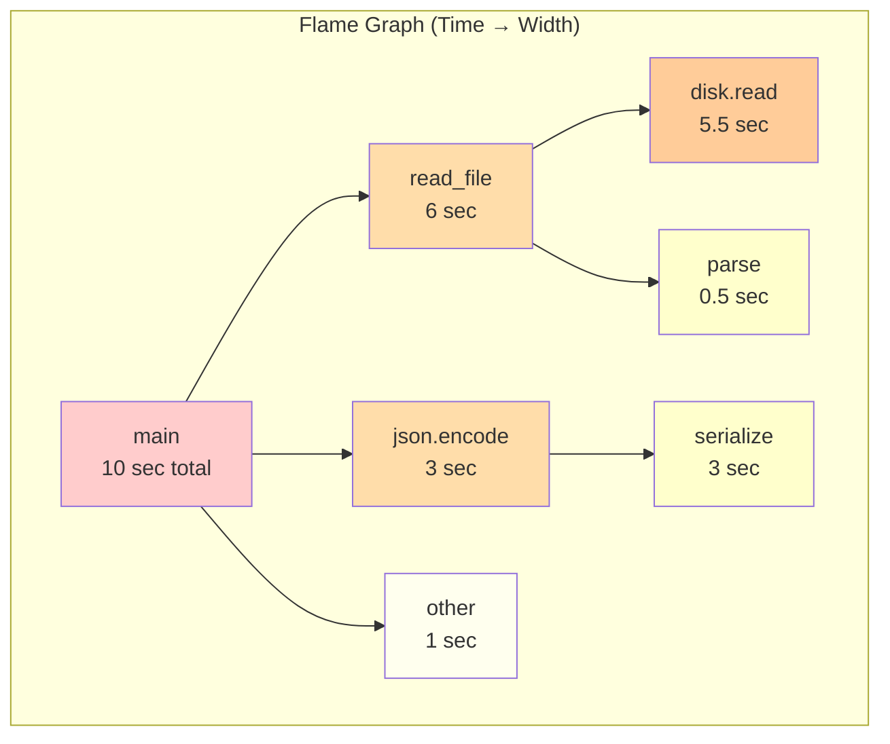
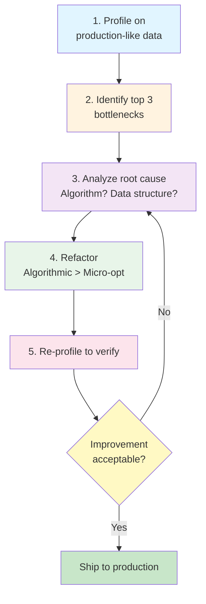

## In one sentence

**Profile your code (measure where time and memory actually go) before optimizing, because intuition about performance is wrong 80% of the time.**

## Why does it matter?

A script that "looks fast" in code review—a few function calls, no obvious loops—can run 10 minutes in production on real data. Meanwhile, a function you thought was slow takes 5 milliseconds. The human brain is terrible at predicting which line of code consumes 80% of execution time. Profiling reveals surprises:

- **Dashboard timeout case**: A reporting script takes 15 minutes to load. Developer assumes the SQL is slow. Profiling shows 30 seconds in SQL, 14 minutes in JSON serialization of 100k rows. Fix: stream JSON instead of buffering all rows.
- **Memory leak case**: A data processing pipeline starts with 2GB of memory, ends with 8GB, then crashes. Memory profiling shows a list of cached DataFrames never being freed. A single `del cached_data` fixes the cascade.
- **Myth vs. reality**: "Intuition finds bottlenecks." Reality: profiling finds them. The difference is the difference between fixing the wrong thing and shipping fast.

When to profile:
- **Before optimization** (measure first, optimize second).
- **On production-like data volumes** (toy examples hide real bottlenecks).
- **When performance matters** (user-facing dashboards, data pipelines, ML training).
- **After optimization** (verify your fix actually worked; sometimes it doesn't).

---

## Core Concept: CPU vs. Memory Profiling

Python has two distinct performance problems:

| **Problem** | **Tool** | **Measures** | **Use when** |
|---|---|---|---|
| **CPU time** | `cProfile`, `py-spy` | Which functions consume most CPU seconds? | Script is slow; user waits. |
| **Memory** | `memory_profiler`, `Memray` | Which objects consume most heap? Where do allocations happen? | Script uses too much RAM; OOM crash occurs. |
| **Call stacks** | Both (via profilers) | How did we get here? Which function called this? | Understand call chain to bottleneck. |

**Key insight**: A function can run fast (low CPU time) but allocate gigabytes (high memory). Both need profiling.

### Call Stacks and Flame Graphs

A **call stack** is the chain of function calls leading to the current line:

```
main()
  → process_data()
    → query_database()
      → socket.recv()  ← we're blocked here
```

A **flame graph** visualizes all call stacks at once:
- **X-axis**: time (wider bar = more time spent)
- **Y-axis**: call depth (stacked = nested function calls)
- **Each box**: one function; width proportional to CPU time

Example structure (ASCII representation):
```
┌──────────────────────────────────┐
│        main()                    │
├─────────────────┬────────────────┤
│  process()      │  serialize()   │  ← top level
├────────┬────────┤                │
│ filter()│ transform()│            │  ← nested
└────────┴────────┴────────────────┘
```

Wide boxes = hot functions (where time is spent). Tall stacks = deep call chains.

---

## Understanding Flame Graphs

### What They Show

A flame graph displays the **entire execution** in one image. Each horizontal bar represents a function; the bar's width shows how long that function ran (including all functions it called). Stacked bars show nesting: a function calls another, which calls another, etc.

### How to Read a Flame Graph

**1. Find the widest bars.** Wide bars = functions running for a long time. These are your bottlenecks.

**Example flame graph layout:**



**2. Look for unexpected wide bars.** If a function you thought was fast has a wide bar, you've found your bottleneck.

**3. Spot patterns.** Repeated stacks (same call chain appearing many times) often indicate inefficiency—e.g., calling an expensive function in a loop.

**4. Check call depth.** Very tall stacks (deep nesting) can indicate recursion issues or excessive abstraction layers.

### Common Observations and What to Do

| **Pattern** | **Interpretation** | **Action** |
|---|---|---|
| One giant bar | Single function dominates. | Optimize that function or replace with faster library. |
| Many small bars of equal width | Time evenly distributed. | No single bottleneck; optimize algorithm or data structure. |
| Repeated short stacks | Loop calling expensive function (e.g., N+1 query pattern). | Batch the operation; move loop outside. |
| Tall stack with narrow bars | Deep recursion or call chain overhead. | Consider iterative approach or memoization. |

---

## CPU Profiling with cProfile

### What cProfile Measures

`cProfile` is Python's built-in CPU profiler. It tracks:
- **How many times** each function was called
- **How long** each function took (cumulative + per-call)
- **Call graph**: which function called which

### Running cProfile

**Method 1: Profile an entire script**

```bash
python -m cProfile -s cumulative script.py
```

Output:
```
       ncalls  tottime  percall  cumtime  percall filename:lineno(function)
            1    0.010    0.010   10.234   10.234 script.py:1(<module>)
       100000    0.050    0.000    5.123    0.000 script.py:42(expensive_function)
       100000    5.073    0.000    5.073    0.000 {method 'sleep' of 'time.time}
        50000    0.234    0.000    1.204    0.000 script.py:18(process_row)
```

**Interpreting the output:**

- `ncalls`: Number of times function was called
- `tottime`: Time spent *in this function only* (not sub-calls)
- `percall`: Average time per call (`tottime / ncalls`)
- `cumtime`: Total time including sub-functions (cumulative time)
- **Sort by `cumtime`**: Find functions consuming most total time

**Method 2: Profile a specific function**

```python
import cProfile
import pstats
from io import StringIO

def my_function():
    result = 0
    for i in range(100000):
        result += expensive_operation(i)
    return result

def expensive_operation(x):
    return x * 2

# Profile it
profiler = cProfile.Profile()
profiler.enable()
my_function()
profiler.disable()

# Print results sorted by cumulative time
stats = pstats.Stats(profiler, stream=StringIO())
stats.sort_stats('cumulative')
stats.print_stats(10)  # Top 10 functions
print(stats.stream.getvalue())
```

### Real-World Example: Data Processing Pipeline

```python
import cProfile
import pstats
from io import StringIO

def load_customers(filename):
    """Simulate loading 100k customer records"""
    customers = []
    for i in range(100000):
        customers.append({
            'id': i,
            'name': f'Customer {i}',
            'email': f'cust{i}@example.com',
        })
    return customers

def validate_customers(customers):
    """Validate each customer record"""
    valid = []
    for customer in customers:
        if '@' in customer['email'] and len(customer['name']) > 0:
            valid.append(customer)
    return valid

def serialize_json(customers):
    """Convert to JSON (slow way)"""
    import json
    return json.dumps(customers)

def main():
    customers = load_customers('customers.csv')
    valid = validate_customers(customers)
    json_str = serialize_json(valid)
    return json_str

# Profile the pipeline
profiler = cProfile.Profile()
profiler.enable()
result = main()
profiler.disable()

# Print top 5 functions by cumulative time
stats = pstats.Stats(profiler)
stats.sort_stats('cumulative')
stats.print_stats(5)
```

**Output (example):**
```
       ncalls  tottime  percall  cumtime  percall filename:lineno(function)
            1    0.000    0.000    2.845    2.845 <string>:1(<module>)
            1    0.050    0.050    2.845    2.845 profile.py:26(main)
            1    1.200    1.200    1.200    1.200 profile.py:13(serialize_json)
            1    0.800    0.800    0.800    0.800 profile.py:17(validate_customers)
            1    0.600    0.600    0.600    0.600 profile.py:5(load_customers)
```

**Interpretation:**
- `serialize_json` takes 1.2 seconds (most time) → **bottleneck**
- `validate_customers` takes 0.8 seconds → secondary concern
- Next step: optimize JSON serialization (e.g., use `ujson` or streaming)

### Generating Flame Graphs

The simplest and most direct approach is **py-spy**, which captures a flame graph without needing a separate conversion step:

```bash
# Install py-spy (cross-platform)
pip install py-spy

# Record a flame graph directly (no code changes needed)
py-spy record -o profile.svg python script.py

# View in browser (py-spy generates SVG directly)
open profile.svg  # macOS/Linux, or open with default browser on Windows
```

**Why py-spy?** It attaches to a running Python process, requires zero code modifications, and outputs the flame graph as SVG directly. Much simpler than capturing cProfile output to a file and then converting. Flame graphs show the call stack (Y-axis) versus time spent (X-axis), making hot functions immediately visible as wide horizontal bars.

---

## Memory Profiling

### When CPU Profiling Isn't Enough

A function can run fast (low CPU time) but consume gigabytes of memory. This causes:
- **Out-of-memory crashes** (OOM)
- **Garbage collection pauses** (freezing the entire program)
- **Swapping to disk** (seeming "hung")

Memory profiling answers: **"Which objects are consuming heap space?"**

### Tools

| **Tool** | **Granularity** | **Overhead** | **Best for** |
|---|---|---|---|
| `memory_profiler` | Line-by-line | High | Finding which lines allocate memory |
| `Memray` | Timeline of all allocations | Medium | Memory leak detection; understanding allocation patterns |
| `tracemalloc` | Python built-in; simpler | Low | Quick snapshots of large objects |

### Line-by-Line Memory with memory_profiler

```python
from memory_profiler import profile

@profile
def process_large_file():
    """Identify which lines allocate memory"""
    data = []  # Line 1: allocate list
    
    for i in range(100000):
        row = {'id': i, 'value': i * 2, 'name': f'Item {i}'}
        data.append(row)  # Line 2: append is O(n) when list resizes
    
    # Process: double memory footprint (copy-on-write)
    doubled = [{'id': d['id'], 'value': d['value'] * 2} for d in data]
    
    # Write to file (streaming is better)
    import json
    with open('output.json', 'w') as f:
        json.dump(doubled, f)
    
    return doubled

if __name__ == '__main__':
    process_large_file()
```

**Run it:**
```bash
python -m memory_profiler process_large_file.py
```

**Output (example):**
```
Filename: process_large_file.py
Line #    Mem usage    Increment   Line Contents
   1    45.0 MiB     0.0 MiB   data = []
   4    45.1 MiB     0.1 MiB   for i in range(100000):
   5    290.5 MiB   245.4 MiB       data.append(row)
   8    580.9 MiB   290.4 MiB   doubled = [...]
  11    580.9 MiB     0.0 MiB   json.dump(doubled, f)
```

**Interpretation:**
- Line 5 (append) consumes 245 MiB
- Line 8 (list comprehension) consumes another 290 MiB → **double memory footprint**
- **Fix**: Stream JSON instead of building in memory

### Memory Timeline with Memray

```python
# same function as above
def process_large_file():
    data = []
    for i in range(100000):
        row = {'id': i, 'value': i * 2, 'name': f'Item {i}'}
        data.append(row)
    doubled = [{'id': d['id'], 'value': d['value'] * 2} for d in data]
    import json
    with open('output.json', 'w') as f:
        json.dump(doubled, f)
    return doubled

if __name__ == '__main__':
    process_large_file()
```

**Run with Memray:**
```bash
pip install memray
python -m memray run -o profile.bin process_large_file.py

# Visualize timeline (shows heap over time)
python -m memray timeline profile.bin
```

This generates a timeline graph showing:
- **X-axis**: Time (execution order)
- **Y-axis**: Memory (heap size in MB)
- **Peaks**: Where memory spikes (allocations)
- **Valleys**: Where memory is freed (garbage collection)

**Key insight**: If heap size doesn't decrease after processing a batch, you have a memory leak (objects not being freed).

### Common Memory Leak Patterns

```python
# Anti-pattern 1: Unbounded cache
cache = {}  # Global cache

def process(key):
    if key not in cache:
        cache[key] = expensive_computation(key)
    return cache[key]

# Problem: cache grows forever; objects never freed
# Fix: Use LRU cache or explicit cleanup

from functools import lru_cache

@lru_cache(maxsize=1000)
def process_fixed(key):
    return expensive_computation(key)
```

```python
# Anti-pattern 2: Circular references in callbacks
class DataProcessor:
    def __init__(self):
        self.data = []
    
    def load_data(self):
        self.data = [1, 2, 3] * 1000000
        
    def cleanup(self):
        self.data = []  # Must explicitly clear

processor = DataProcessor()
processor.load_data()
# If you forget cleanup(), memory is held until GC kicks in
```

---

## From Profile to Optimization: A Systematic Workflow

Profiling reveals bottlenecks; optimization removes them. The workflow is:



### Step 1: Profile Real Data

```python
import cProfile
import pstats
from io import StringIO

# Profile with REAL data (not toy examples)
def process_production_data():
    """Load 1M rows from production database"""
    import sqlite3
    conn = sqlite3.connect(':memory:')
    cursor = conn.cursor()
    
    # Create 1M rows
    cursor.execute('CREATE TABLE logs (id INT, msg TEXT, level TEXT)')
    cursor.executemany(
        'INSERT INTO logs VALUES (?, ?, ?)',
        [(i, f'msg {i}', 'INFO' if i % 2 == 0 else 'WARN') for i in range(1000000)]
    )
    
    # Query + filter
    cursor.execute('SELECT * FROM logs WHERE level = ?', ('WARN',))
    return cursor.fetchall()

profiler = cProfile.Profile()
profiler.enable()
result = process_production_data()
profiler.disable()

stats = pstats.Stats(profiler)
stats.sort_stats('cumulative')
stats.print_stats(10)
```

### Step 2: Identify Top 3 Bottlenecks

Look at `cumtime` (cumulative time). If:
- Function A: 6 seconds (60%)
- Function B: 2 seconds (20%)
- Function C: 1 second (10%)
- Others: 1 second (10%)

**Focus on A and B; ignore C and others.** (80/20 rule: 80% of time in 20% of functions.)

### Step 3: Analyze Root Cause

Ask:
- **Algorithmic problem?** O(n²) loop that should be O(n log n)?
- **Data structure problem?** List lookup (O(n)) that should be dict (O(1))?
- **I/O problem?** Fetching data one row at a time instead of batch?
- **Library problem?** Slow library available; faster alternative exists?

### Step 4: Refactor (Algorithmic First)

**Micro-optimizations only matter after profiling shows they're bottlenecks.**

**Example: Before and After**

**Before (slow):**
```python
def find_duplicates(items):
    """O(n²) — compares each item to all others"""
    duplicates = []
    for i, item in enumerate(items):
        for j in range(i+1, len(items)):
            if items[i] == items[j]:
                duplicates.append(item)
    return duplicates

# On 10k items: ~100M comparisons, 5 seconds
```

**After (fast):**
```python
def find_duplicates_fast(items):
    """O(n) — single pass with set lookup"""
    seen = set()
    duplicates = []
    for item in items:
        if item in seen:
            duplicates.append(item)
        else:
            seen.add(item)
    return duplicates

# On 10k items: ~10k lookups, 5 milliseconds
```

**Profile both:**
```python
import cProfile, pstats
from io import StringIO

items = list(range(10000)) * 2  # 20k items with duplicates

# OLD
profiler = cProfile.Profile()
profiler.enable()
result_old = find_duplicates(items)
profiler.disable()
stats = pstats.Stats(profiler)
print("OLD: ", end='')
stats.print_stats(1)  # Top 1 function

# NEW
profiler = cProfile.Profile()
profiler.enable()
result_new = find_duplicates_fast(items)
profiler.disable()
stats = pstats.Stats(profiler)
print("NEW: ", end='')
stats.print_stats(1)
```

### Step 5: Re-Profile to Verify

After refactoring, profile again. You should see:
- `cumtime` for that function drops significantly
- Total script time improves
- No new bottlenecks appear (you didn't trade one problem for another)

---

## Decision Tree: Profile vs. Optimize

```mermaid
graph TD
    A["Is the script slow?"] -->|No| B["Ship it"]
    A -->|Yes| C["Have you profiled?"]
    C -->|No| D["STOP. Profile first.<br/>Don't guess."]
    D --> E["Run cProfile:<br/>python -m cProfile -s cumulative script.py"]
    E --> F["Identify top 3<br/>functions by cumtime"]
    F --> G{"Are they<br/>micro-opt<br/>candidates?"}
    G -->|Yes, algorithmic| H["Refactor algorithm<br/>or data structure"]
    G -->|No, I/O or system| I["Profile with py-spy<br/>or memory_profiler"]
    H --> J["Re-profile"]
    I --> J
    J --> K{"Improvement<br/>good enough?"]
    K -->|Yes| B
    K -->|No| F
    
    style A fill:#fff3e0
    style C fill:#fff3e0
    style D fill:#ffcccc
    style B fill:#c8e6c9
    style G fill:#fff3e0
    style K fill:#fff3e0
```

---

## Common Mistakes

- **Profiling toy data.** A function that processes 100 items "looks fast" but takes 10 minutes on 1M items. Profile with real data volumes.
- **Trusting intuition.** "That loop must be slow." Profile it first. Often it's not.
- **Micro-optimizing too early.** Changing `list.append()` to `collections.deque()` saves microseconds if the function takes 5 seconds total. Focus on functions taking 80% of time.
- **Forgetting to re-profile.** "I optimized this." But did it actually help? Re-profile to verify.
- **Optimizing the wrong thing.** Profiling shows 60% of time in SQL, but you optimize Python. Fix the bottleneck, not something else.

::: {.callout-warning}
**Profile production-like data, not toy examples.** A 1000-row dataset hides O(n²) problems that explode on 1M rows.
:::

::: {.callout-warning}
**Micro-optimizations matter only after profiling shows they're bottlenecks.** Premature optimization wastes time.
:::

::: {.callout-warning}
**Memory leaks are hard to detect without profiling.** A script that "works fine locally" can crash in production after 8 hours. Use `memory_profiler` or `Memray` before it becomes a production incident.
:::

---

## Remember

::: {.callout-tip}
**Measure, don't guess.** Profiling reveals surprises. Focus your refactoring on the 20% of functions consuming 80% of time. Re-profile to verify your fix actually worked.
:::

---

## Test yourself

**Question 1:** You profile a data processing script. `cProfile` output shows:
- `query_database()`: 8 seconds (80% of total)
- `parse_json()`: 1 second (10%)
- `validate_data()`: 1 second (10%)

You can optimize either `parse_json()` (reduce by 50%) or `query_database()` (reduce by 10%). Which should you optimize first, and why?

<details>
<summary>Answer</summary>
`query_database()`, because it consumes 80% of time. Optimizing it by 10% saves 0.8 seconds (80% of total time saved). Optimizing `parse_json()` by 50% saves only 0.5 seconds. Focus on functions consuming the most time, not the most *easily* optimizable ones.
</details>

**Question 2:** Your script allocates 500 MB of memory in the first 2 seconds, then memory stays flat. After you add `gc.collect()` at the end, memory drops. What does this tell you?

<details>
<summary>Answer</summary>
Memory was being held by objects that *could* be freed, but garbage collection hadn't run yet. This is **not** a memory leak (objects were properly released). If memory had stayed at 500 MB even after `gc.collect()`, you'd have a leak (objects held by lingering references). Use `gc.get_referrers(obj)` to trace which objects are preventing garbage collection—look for module-level caches, circular references, or singletons that hold references longer than expected.
</details>

---

## Related topics

- [Python Testing and Debugging](python-testing.qmd) — Unit tests catch logic errors; profiling catches performance errors.
- [Python Database Access](python-database-access.qmd) — Slow database queries often dominate profiles; know how to write efficient SQL.
- [SQL Query Optimization & Performance](sql-query-optimization.qmd) — Bridge between Python and database performance; EXPLAIN plans reveal hidden costs.
- [Error Handling and Debugging](python-error-handling.qmd) — Debugging specific errors; profiling finds performance problems before they crash.
